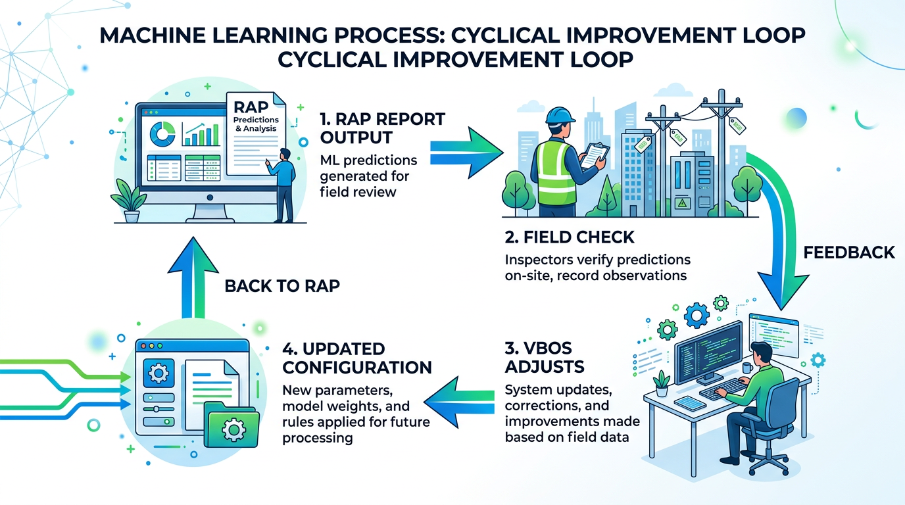
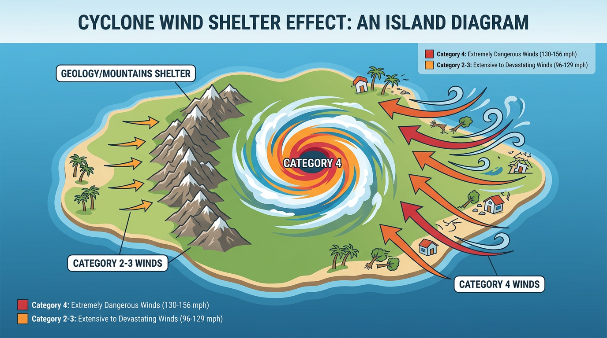

## DSSPAC Post Disaster Needs Assessment — Training

**Context:** This presentation is part of the DSSPAC Post Disaster Needs Assessment (PDNA) training.

**Aim:** To **entirely replace manual post disaster assessments** — which cost the Vanuatu Government so much money — with a rapid, data-driven approach.

**RAP + MIS:** Automated damage, resource, and financial estimates that can be refined through field verification.

::: {.notes}
Welcome everyone. We're here for the DSSPAC Post Disaster Needs Assessment training. The big aim is to stop doing manual assessments — they cost the government a lot of money. Instead we use RAP and MIS: you get damage and resource estimates quickly, then check them in the field and improve over time.
:::

---

## What it is

**Disaster Damage and Response Estimation** — Rapid assessment after a cyclone

- **Damage** — Schools, health facilities, crops, roads, shelter, WASH
- **Resources** — Tents, solar lamps, water, food, crop cuttings
- **Financial impact** — Repair costs, crop loss valuation

**Output:** Interactive HTML report, tables, maps, CSV exports

::: {.notes}
So what is RAP? After a cyclone, it gives you damage numbers — schools, health, crops, roads, shelter, water. It tells you what resources you need — tents, lamps, food. And it puts a dollar figure on the damage. You get an HTML report with tables and maps, plus CSV files you can use elsewhere. A full sample report will be shared by email.
:::

---

## Why replace manual assessments?

| Manual PDNA | RAP + MIS |
|-------------|-----------|
| **High cost** — Field teams, travel, per diem, logistics | **Low cost** — Run on existing data, update config from VMGD maps |
| **Slow** — Days or weeks to mobilise and complete | **Fast** — Report in minutes once intensity is assigned |
| **Inconsistent** — Varies by team, timing, methodology | **Consistent** — Same formulas, auditable, repeatable |
| **One-off** — Each disaster starts from scratch | **Improving** — Field checks feed back, multipliers refined |

**Goal:** Reduce the financial burden on the Vanuatu Government while improving speed and consistency of post-disaster estimates.

::: {.notes}
Why switch? Manual assessments are expensive — you pay for field teams, travel, per diem. They take days or weeks. And each team might do things differently. With RAP, you run it on data you already have. Once you assign intensity from the VMGD map, you get a report in minutes. Same formulas every time. And when field teams check and find errors, we adjust the system. It gets better over time.
:::

---

## Technical: Cyclone Intensity

**The engine:** `Ex_hazard_areas.csv` — one row per Area Council

| Column | Role |
|--------|------|
| National | Country |
| Province | Province name |
| Area Council | Council name |
| Hazard | e.g. Cyclone |
| **Intensity** | **2–5** (category) |

**Source:** VMGD cyclone track maps → overlay on Area Council boundaries

- Near eye → Cat 4 or 5
- Outer bands → Cat 2 or 3
- Outside cone → 0

**Same cyclone, different intensities per council** — e.g. Shefa Cat 4, Malampa Cat 2

::: {.notes}
The heart of the system is a simple config file. One row per Area Council. You get the cyclone track from VMGD, overlay it on the council map, and assign a number 2 to 5. Near the eye it's Cat 4 or 5. Further out, Cat 2 or 3. Outside the cone, zero. One cyclone can hit Shefa at Cat 4 and Malampa at Cat 2 — that's fine, we handle that.
:::

---

## How it drives everything

1. **Baseline** — Pre-disaster data from `1c_input_baseline.csv`
2. **Damage** — `baseline × damage_multiplier(intensity, sector)`
   - Multipliers are **council- and intensity-specific**
3. **Resources** — Affected units × resource multipliers
4. **Finance** — Damaged units × unit costs from config
5. **Aggregation** — Council → Province → National

::: {.notes}
How does it work? You start with baseline data — schools, health facilities, crops, whatever. You multiply by a damage factor that depends on intensity and council. That gives you damage. From damage you get resources needed. From damage you get financial cost. Then you add up council to province to national. All driven by that one intensity number per council.
:::

---

## Show & Go — 3 Clusters

### Education
- Baseline: Schools, students, teachers (ECCE, Primary, Secondary)
- Damage: Damaged schools, students affected
- Resources: Tents, lamps, school kits
- Finance: Repair costs

### Health
- Baseline: Facilities, staff
- Damage: Damaged facilities
- Finance: Repair costs

### Food Security
- Baseline: Crops, households
- Damage: Damaged crops
- Resources: Cuttings, water, tinned fish, rice
- Finance: Crop loss valuation

::: {.notes}
Let me walk through three clusters. Education: we have schools, students, teachers. We estimate damaged schools and affected students. We say how many tents and lamps you need. We put a cost on repairs. Health: same idea — facilities, damage, repair cost. Food Security: crops, damage, then cuttings and water and rice for recovery, plus crop loss value. The full report has more sectors — we're just showing the pattern here.
:::

---

## Quality Checks

| Check | Purpose |
|-------|---------|
| Area Councils recognized | No typos or unknown names |
| No capitalization issues | Avoid duplicate councils |
| Config–baseline alignment | Councils in hazard config have baseline data |
| Required baseline completeness | Education, Energy, Food Security, etc. |
| Intensity assignments valid | Range 2–5, complete for affected councils |
| Output file validation | No negative values, NAs in exports |

**QC outputs:** `QC_baseline_coverage.csv`, `QC_manual_review_sample.csv`

::: {.notes}
The report runs quality checks. Are council names right? No typos or duplicates? Does the hazard config match the baseline data? Do all councils have the required baselines? Is intensity in the right range? Do the output files look clean? We export QC files so you can spot issues before you use the numbers.
:::

---

## Outputs

### HTML report
- Interactive tables (sortable, paginated)
- Leaflet maps by sector
- Intensity map (QC verification)

### CSV exports (`output/`)

| Prefix | Content |
|--------|---------|
| Education_* | Schools, damage, resources, finance |
| Health_* | Facilities, damage, finance |
| FoodSecurity_* | Crops, damage, resources, finance |
| Health_*, Logistics_*, Shelter_*, WASH_*, Telecom_*, Energy_* | Sector-specific |
| QC_* | Quality-control samples |

### GeoJSON / Shapefile
- `area_councils_intensity.geojson` — For GIS / MIS use

### ZIP
- `vanuatu_outputs.zip` — All CSV files for download

::: {.notes}
What do you get? An HTML report with interactive tables and maps. CSV files for each sector — education, health, food, and so on. A GeoJSON and shapefile of intensity by council for GIS or the MIS. And a zip of all CSVs for easy sharing. You can open the HTML in a browser, no special software needed.
:::

---

## Sectors covered

| Sector | Baseline | Damage | Resources | Finance |
|--------|----------|--------|-----------|---------|
| Education | Schools, students | ✓ | ✓ | ✓ |
| Health | Facilities, staff | ✓ | — | ✓ |
| Food Security | Crops | ✓ | ✓ | ✓ |
| Emergency Telecom | Towers | ✓ | — | ✓ |
| Energy | Electricity, fuel | ✓ | ✓ | ✓ |
| Shelter | Housing | ✓ | ✓ | ✓ |
| WASH | Water, toilets | ✓ | ✓ | ✓ |
| Logistics | Roads, infra | ✓ | ✓ | ✓ |
| Gender & Protection | Population | — | ✓ | — |

::: {.notes}
We cover nine sectors. Education, Health, Food Security, Telecom, Energy, Shelter, WASH, Logistics, and Gender and Protection. Each has baseline, damage, resources, or finance depending on the sector. The table shows what's in the report for each.
:::

---

## Customisation

**Everything is customisable at the Vanuatu Bureau of Statistics:**

- **Cyclone intensity** — Update `Ex_hazard_areas.csv` from VMGD maps (template provided)
- **Baseline data** — `1c_input_baseline.csv`
- **Damage multipliers** — By sector, intensity, council
- **Resource and finance configs** — Quantities, unit costs
- **Region order** — Council and province ordering in tables

The MIS frontend layout and backend have already gone through many layout and feature changes — both systems evolve with use.

::: {.notes}
Everything is in your hands. VBoS can change cyclone intensity, baseline data, damage multipliers, resource and finance configs, even the order of councils in tables. The MIS has already had lots of layout and feature changes — frontend and backend. Both systems are built to evolve.
:::

---

## Same philosophy as the MIS

**Susie will present the MIS system next.**

Both are designed for **in-country ownership**:

- Vanuatu Bureau of Statistics can maintain and adapt inputs
- No external support required once set up
- Cyclone intensity from RAP → export script → loads into MIS
- MIS frontend and backend have already gone through many layout and feature changes — everything is adaptable

::: {.notes}
Susie will show the MIS next. Same idea: VBoS owns it. No external support needed. You run RAP, export the intensity, load it into the MIS. The MIS has already had many changes — layout, features. Everything can be adapted as you learn what works.
:::

---

## Summary

**One config file** with cyclone intensity per council drives damage, resources, and finance across all sectors.

**All inputs** are customisable by Vanuatu Bureau of Statistics — same as the MIS.

**Aim:** Replace costly manual post disaster assessments with rapid, data-driven estimates — reducing the financial burden on the Vanuatu Government while improving speed and consistency for PDNA.

::: {.notes}
So to sum up: one config file with intensity per council drives everything. All inputs are customisable by VBoS. The aim is to replace costly manual assessments with fast, consistent estimates — less cost for government, better for PDNA.
:::

---

## Can we quantify building or garden damage?

**Yes — all hazards can be quantified.** We just need the right tools and formulas.

{width=55%}

*Analogy:* Remove math from a plane, leave only the naked pilot. Even the human pilot can be quantified — there is a golden ratio in it. So too with building damage, crop damage, or any hazard: the challenge is finding the right tools and formulas, not whether quantification is possible.

::: {.notes}
Someone might ask: can we really put numbers on building damage or garden damage? Yes. Everything can be quantified if you have the right tools. Think of a plane — take away the math, you still have the pilot. Even the pilot has a golden ratio. Same for damage. The question isn't "can we" — it's "what tools and formulas do we need." We're building those.
:::

---

## MIS: Field checks & continuous improvement

**The MIS adds another step: field verification.**

{width=55%}

- Within the first 10 years of using RAP and MIS, **many field checks** will verify the RAP estimations
- If estimates are wrong → **feedback** → VBoS adjusts multipliers and configs accordingly
- It is a **machine learning process**: the system improves with each cycle

::: {.notes}
The MIS adds field checks. In the first 10 years you'll do lots of them. If the RAP estimate is wrong, you feed that back. VBoS adjusts the multipliers. The system learns. It's like machine learning — each cycle makes it better.
:::

---

## Cyclone wind shelter effect: an island diagram

{width=60%}

**Example:** Category 4 may hit an island, but due to geology or mountains, some areas only face Category 2 or 3 winds. With time, all these nuances will be captured and refined within the MIS.

::: {.notes}
Here's an example. Cat 4 hits an island. But mountains or geology shelter some areas — they only get Cat 2 or 3 winds. Right now we might assign one intensity per council. Over time, as field checks come in, we'll capture these nuances. The MIS will get more detailed. That's the improvement loop.
:::

---

## Thank you

Questions?

*Full Disaster Damage and Response Estimation sample report shared via email*

::: {.notes}
Thanks everyone. Any questions? Remind them the full sample report will be shared by email. Hand over to Susie for the MIS if that's the plan.
:::
